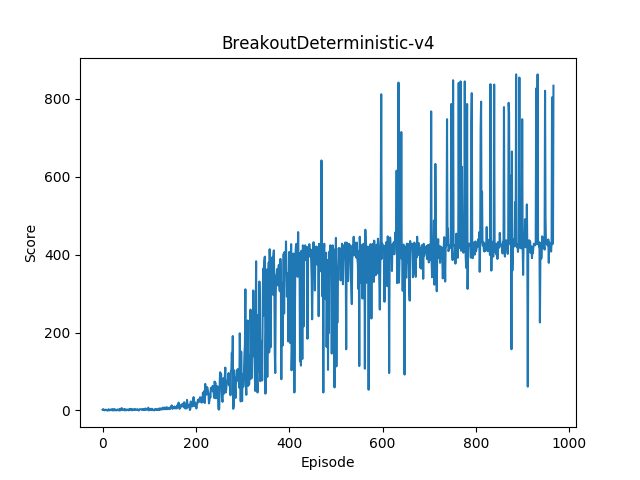
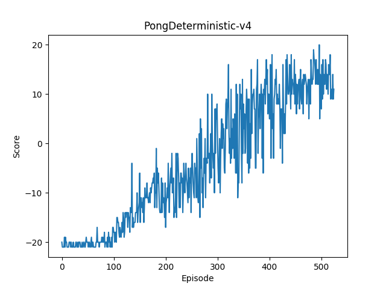
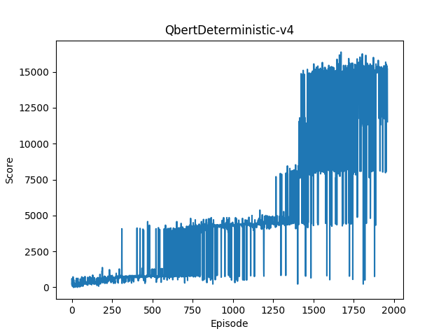

# paac-pytorch

This is a PyTorch implementation of PAAC from ["Efficient Parallel Methods for Deep Reinforcement Learning"](https://arxiv.org/abs/1705.04862)

      

# Environments
- Ubuntu 16.04
- python 3.5.2
- PyTorch 0.2.0
- NumPy 1.13.1
- gym 0.9.2
- matplotlib

# Usage
- You can train the agent by:

```
python main.py --env-name BreakoutDeterministic-v4 --num-workers 4
```

- You can play the game by:
```
python play.py --env-name BreakoutDeterministic-v4
```

# Results
<p float="first 4 envs">
  
  
  
  
</p>

# Notes


# References

- [origin paper's open source](https://github.com/Alfredvc/paac)
- [openai's universe-starter-agent](https://github.com/openai/universe-starter-agent)
- [pytorch-a3c](https://github.com/ikostrikov/pytorch-a3c)

